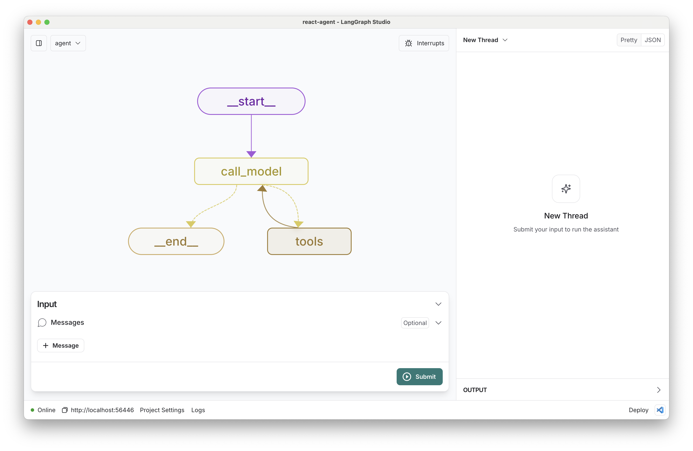

# Notebook Agent Local Template

[](https://github.com/langchain-ai/react-agent/actions/workflows/unit-tests.yml)
[](https://github.com/langchain-ai/react-agent/actions/workflows/integration-tests.yml)
[![Open in - LangGraph Studio](https://img.shields.io/badge/Open_in-LangGraph_Studio-00324d.svg?logo=)](https://langgraph-studio.vercel.app/templates/open?githubUrl=https://github.com/langchain-ai/react-agent)

框架基于Langgraph，用于本地搭建一个Notebook Agent，以E2E的方式生成Notebook。支持以下功能：
- 对指定数据进行探索性分析（EDA）
- 对指定数据进行统计分析，并完成假设检验
- 根据已有的notebook模版，对新的数据生成类似的报告（Todo）

## What it does




The Notebook Agent:

1. 输入用户生成报告的指令，例如：
- 生成针对tmall_order_report.csv的数据分析notebook；
- 生成包含对tmall_order_report.csv进行假设检验的notebook

2. 调用工具 summary_csv，获取数据源的summary
3. 根据 summary 与人工输入要求判断notebook应该包含哪些内容
4. Human in the loop，人工判断以上内容是否符合要求（进行中）
5. 重复3-4步骤，直到应生成内容符合要求（进行中）
6. 调用工具生成notebook框架，并写入到指定位置


## Getting Started

1. In the root of the langgraph app, install the dependencies.

```bash
cd path/to/your/app
pip install -e .
```

2. Create a `.env` file.

```bash
cp .env.example .env
```

3. Define required API keys in your `.env` file.

```bash
LANGSMITH_PROJECT=xxx
DEEPSEEK_API_KEY=sk-xxx
```
4. Setup Model

The defaults values for `model` are shown below:

```yaml
model: deepseek/deepseek-chat
```

5. Customize whatever you'd like in the code.


6. Start the LangGraph API server locally
```bash
langgraph dev
```

7. Test your application in LangGraph Studio¶
LangGraph Studio is a specialized UI that you can connect to LangGraph API server to visualize, interact with, and debug your application locally. Test your graph in LangGraph Studio by visiting the URL provided in the output of the langgraph dev command:

```bash
LangGraph Studio Web UI: https://smith.langchain.com/studio/?baseUrl=http://127.0.0.1:2024
```

## How to customize

1. **Add new tools**: Extend the agent's capabilities by adding new tools in [tools.py](./src/react_agent/tools.py). These can be any Python functions that perform specific tasks.
2. **Select a different model**: We default to Anthropic's Claude 3 Sonnet. You can select a compatible chat model using `provider/model-name` via configuration. Example: `openai/gpt-4-turbo-preview`.
3. **Customize the prompt**: We provide a default system prompt in [prompts.py](./src/react_agent/prompts.py). You can easily update this via configuration in the studio.

You can also quickly extend this template by:

- Modifying the agent's reasoning process in [graph.py](./src/react_agent/graph.py).
- Adjusting the ReAct loop or adding additional steps to the agent's decision-making process.